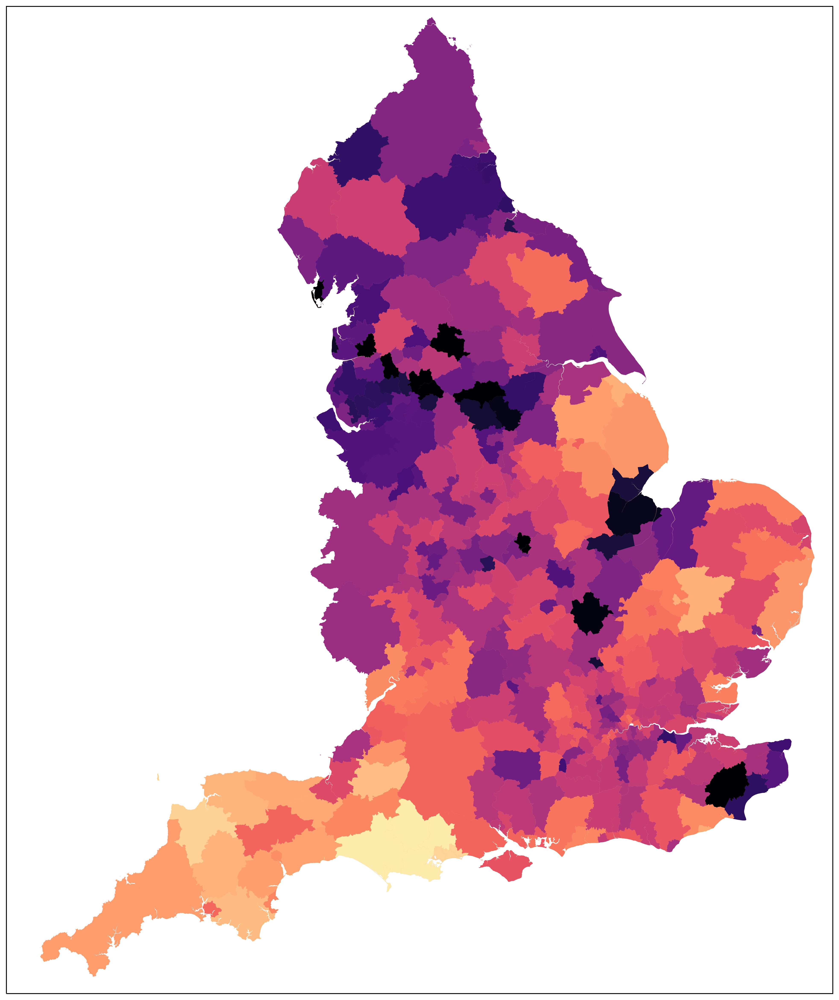
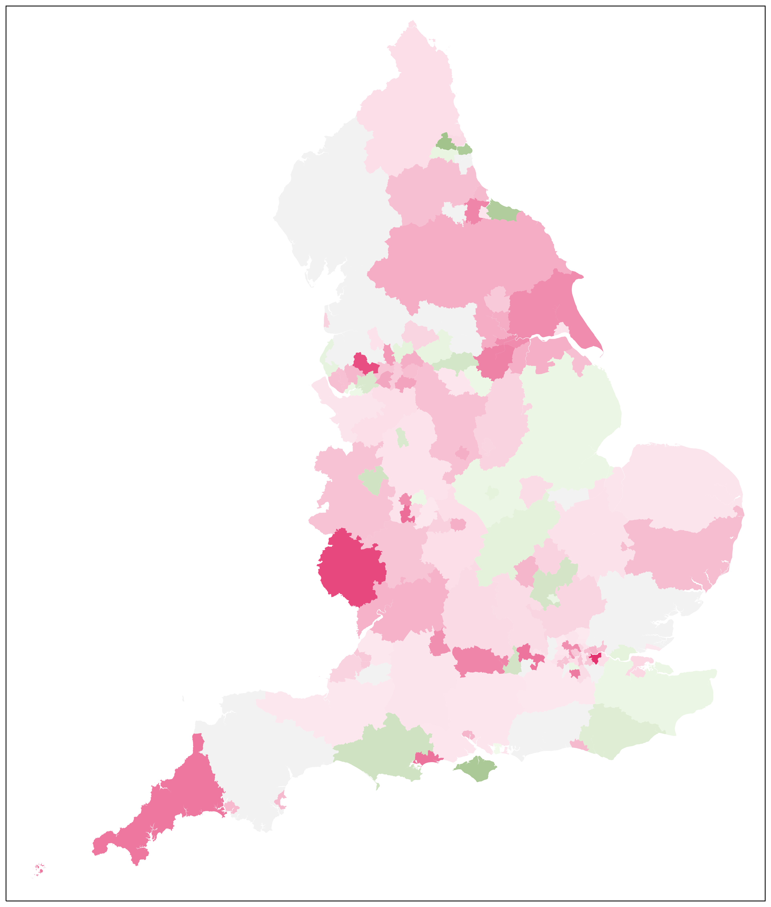
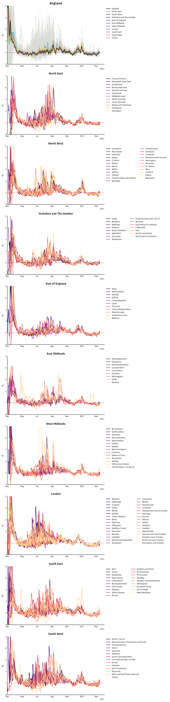
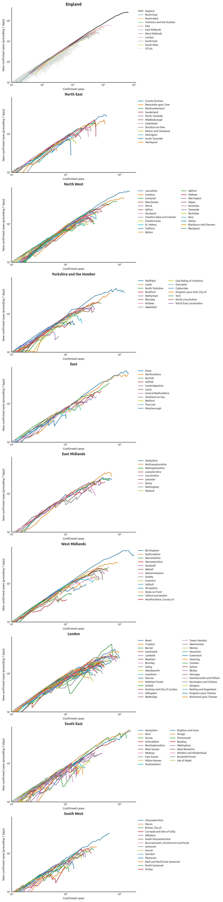

# covUK

Public Health England (PHE) is currently publishing daily updates of the regional breakdown of confirmed Covid-19 cases in English UTLAs.

This repository tracks the evolution of the regional case counts over time.  It should update automatically each day, shortly after the day's results have been published.

## Case density

(colour map: black ~ 8 cases per 1000)

## R(t) snapshot

(colour map: green R < 1; white R ~ 1; red R > 1)

## Regional data over time

## Estimate of R(t), over time

Methodology based on RKI's.

## Exponential potential

In exponential growth, the rate of increase is proportional to the total at the time.  By plotting these against each other, we can detect the eventual departure from exponential growth when it occurs.  Any variation in the slope of the graph is due to changes in the exponential growth-parameter, representing a deviation from pure exponentiality.  As growth tails off the eventual *x*-intercept represents the final count.

