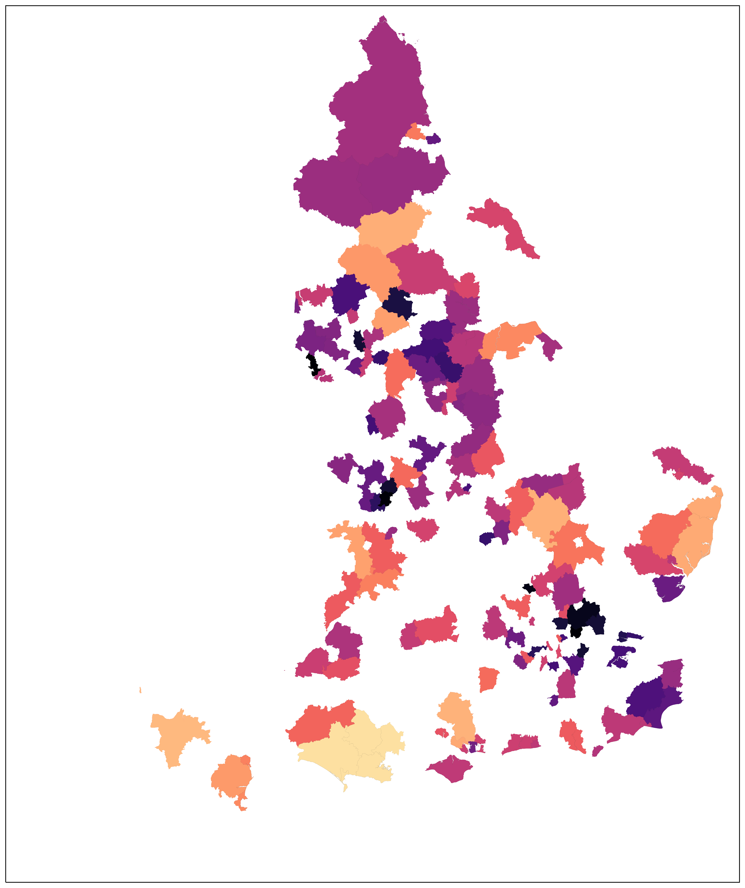
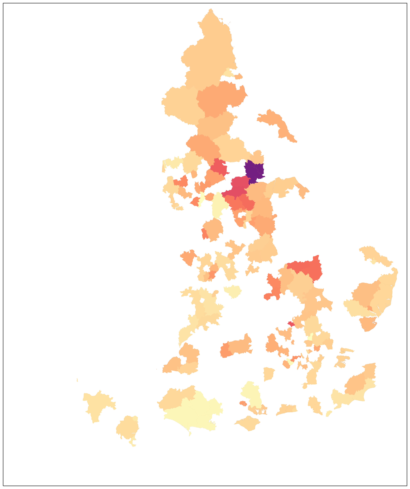
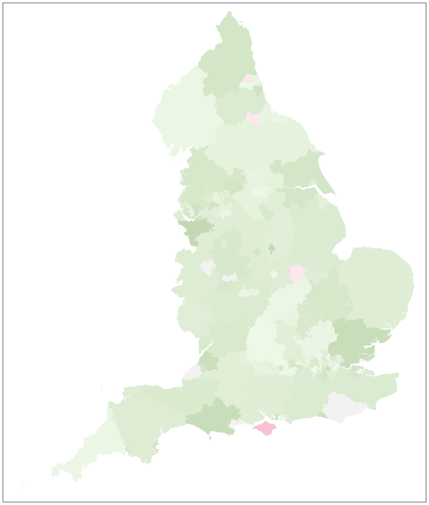
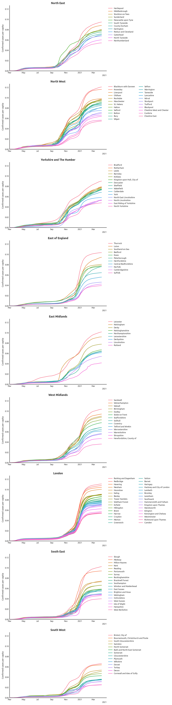
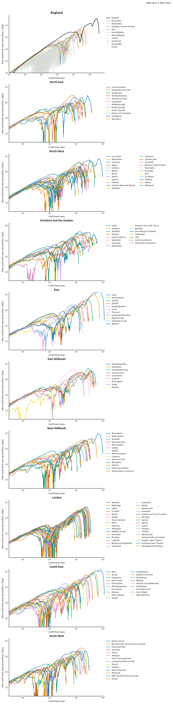

# covUK

Public Health England (PHE) is currently publishing daily updates of confirmed Covid-19 case numbers in English local authorities.

This repository tracks the evolution of the regional case counts over time.  It digests the PHE data to produce some graphs, chiefly for my personal use, summarising the progression of the epidemic.

It should update automatically each day, shortly after the day's results have been published.

## Case density

(colour map: black ~ 8 cases per 1000)

## New case density (~last week)
(colour map: black ~ 2 new cases per 1000)

## R(t) snapshot

(colour map: green R < 1; white R ~ 1; red R > 1)

## Estimate of R(t), over time

Methodology based on RKI's.

## Regional data over time
### Density of cases

### Total number of cases

## Exponential potential

In exponential growth, the rate of increase is proportional to the total at the time.  By plotting these against each other, we can detect the eventual departure from exponential growth when it occurs.  Any variation in the slope of the graph is due to changes in the exponential growth-parameter, representing a deviation from pure exponentiality.  As growth tails off the eventual *x*-intercept represents the final count.

