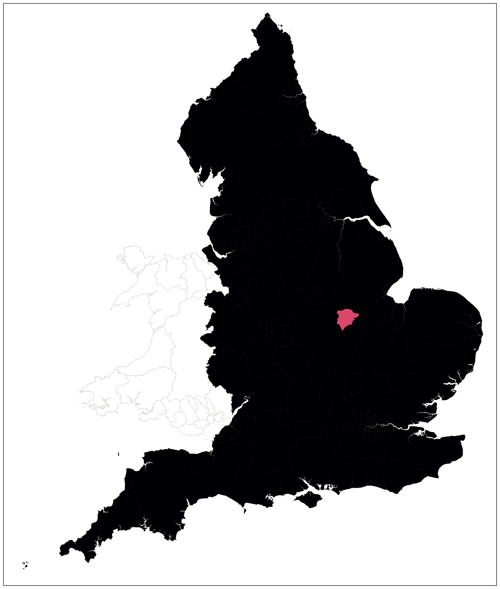
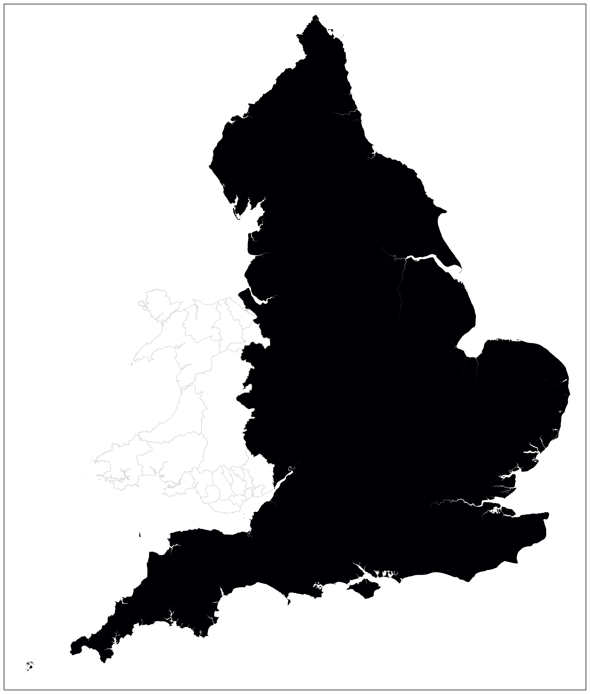

# covUK

Public Health England (PHE) is currently publishing daily updates of the regional breakdown of confirmed Covid-19 cases in English UTLAs.

This repository tracks the evolution of the regional case counts over time.  It should update automatically each day, shortly after the day's results have been published.

## Case distribution

## Case density

(colour map: black ~ 3 cases per 1000)

## Regional data over time

